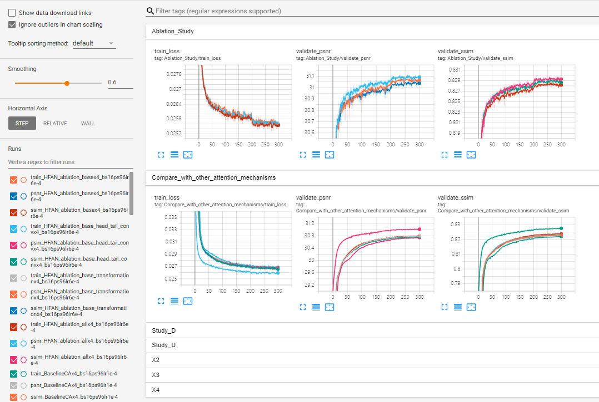
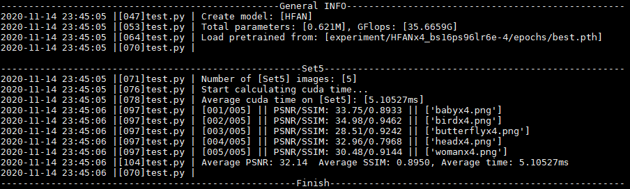
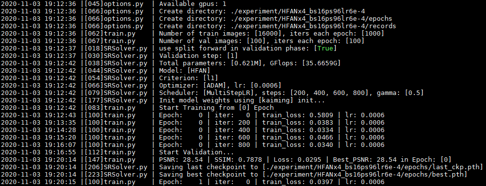

# Requirements
See [requirements.yaml](https://github.com/SR-HFAN/HFAN/blob/master/requirements.yaml). If you have anaconda, you can use the following instructions to copy my conda environment:
1. First make sure your nvidia driver version is larger than 410.48
```bash
nvidia-smi
```

2. Create conda environment from requirements.yaml
```bash
conda env create -f requirements.yaml
source activate HFAN
```

If you want to figure out which file includes the libraries(take tensorboardX as an example), you can use:
```bash
grep -rn --color=auto 'tensorboardX'
```

# Datasets
We use DIV2K as our training and validation sets, five benchmark datasets as testing sets. Download them from [here](https://drive.google.com/drive/folders/10kLWREni6v7hYFye2kuESaqT25hiM-8v?usp=sharing), and put ```DIV2K``` and ```Benchmark``` under the directory of ```data```.

# Check
* Models
    * All models are defined in ```solvers/networks/```, and corresponding configuration files are in ```options/train/```.
    * We use ```train_demo.sh``` to train all models.
* Logs
    * There are detailed training and testing logs of all the experimental results reported in our article. They are stored in ```log/``` and ```test_log/```, respectively. You can check the number of parameters, FLOPs, traning and validating process, inference time and performance on every benchmark image.
    * The best weights are stored in ```experiment/```.
    * We also record every validating process by tensorboardX. You can visualize them using: ```tensorboard --logdir Tensorboard```. Then the following interface will appear on your screen.

      

# Test
You can find the script of the desired model in ```test_demo.sh``` and uncomment the corresponding line. Then run:
```bash
sh test_demo.sh
```
The test results will appear on your screen.


# Train
You can retrain any model reported in our article using ```train_demo.sh``` by uncommenting the corresponding line. Then the following training procedure will appear on your screen.


